# Shape of Life Architecture

This document describes the architecture currently implemented in this repository and the near-term architecture defined in `plan.md`. It is intentionally split between **implemented now** and **planned next** to avoid spec drift.

## 1. System Overview

Shape of Life is a Bun monorepo with four active surfaces:

- `packages/sim`: TypeScript canonical simulation primitives and parity oracle.
- `packages/contracts`: Solidity engine parity + round-lifecycle guard implementation (Foundry-tested).
- `packages/indexer`: TypeScript reconciliation checks for accounting-critical round events.
  - Includes chain-ingesting round read-model sync tooling with persisted JSON snapshots.
- `apps/web`: Next.js App Router scaffold for spectator-facing UI and simple API routes.

Shared deterministic fixtures live in `fixtures/engine/parity.v1.json`.

Additional docs:
- `concept.md`: user-facing game rules and Conway's Game of Life concept explainer (non-technical).
- `plan.md`: full v0.1 spec, implementation plan, progress log, and readiness checklist.

## 2. Workspace Topology

### 2.1 Monorepo + Tooling

- Runtime/package manager: Bun (`packageManager: bun@1.3.6`).
- Workspaces: `apps/*`, `packages/*` (root `package.json`).
- Core test commands:
  - `bun test` (aggregate sim + web + indexer + contract-script + Solidity contract tests)
  - `bun test packages/sim/test`
  - `cd apps/web && bun run test`
  - `bun test packages/indexer/test`
  - `bun test packages/contracts/scripts/*.test.ts`
  - `cd packages/contracts && forge test --offline`
  - `bun run test:contracts:gas` (`forge snapshot --offline --match-test testGas --check`)
  - `bun run benchmark:sepolia:max-batch` (requires `SHAPE_SEPOLIA_RPC_URL` and deployed `ROUND_ADDRESS`)
  - `bun run observe:sepolia:keeper` (requires `SHAPE_SEPOLIA_RPC_URL` and deployed `ROUND_ADDRESS`)

### 2.2 Package Responsibilities

- `packages/sim`
  - `src/engine.ts`:
    - Board validation
    - 64-bit row packing/unpacking (`packRows`, `unpackRows`)
    - One-generation stepping (`stepGeneration`) for cylinder topology
  - `test/engine.test.ts`: unit tests for packing, B3/S23 behavior, immigration majority
  - `test/parity.test.ts`: fixture vectors + deterministic seeded fuzz parity vs reference implementation

- `packages/contracts`
  - `src/ConwayEngine.sol`:
    - Solidity parity engine for one generation
    - Invariant checks (`InvalidDimensions`, `InvalidRowsLength`, `OverlappingCells`)
  - `src/ArenaRegistry.sol`:
    - Owner-managed registry storing `currentRound`, `pastRounds[]`, and `seasonMetadataHash`
    - Functions: `setCurrentRound`, `setSeasonMetadataHash`, `transferOwnership`, `pastRoundCount`, `allPastRounds`
    - Events: `CurrentRoundUpdated`, `SeasonMetadataHashUpdated`
  - `src/ConwayArenaRound.sol`:
    - Commit/reveal/sim/claim phase state machine with explicit phase and time-window guards
    - 64x64 board-state storage (`blueRows`, `redRows`) and final board-derived population/invasion snapshots
    - `initialize()` materializes revealed slot seed bits into deterministic board coordinates
    - `stepBatch()` advances board state by invoking `ConwayEngine.step` across bounded batches
    - `finalize()` derives board status and winner resolution at max generation from weighted score outputs (`3*population + 2*invasion`)
    - Step clamping semantics: `actualSteps = min(requestedSteps, maxBatch, maxGen - gen)`
    - Commit-domain separation primitive `hashCommit(roundId, chainId, arena, player, team, slotIndex, seedBits, salt)`
    - Accounting primitives for v0.1 payout safety:
      - keeper reward shortfall clamp
      - early accounting funding invariant check (`totalFunded <= address(this).balance`) at configuration time
      - keeper pull-withdraw credits (`withdrawKeeperCredit`) with no-credit guard
      - winner payout transfer allocation for winning/draw revealed slots via `claim(uint8)`
      - explicit non-reentrancy guard on transfer paths (`claim`, `withdrawKeeperCredit`)
      - manual settlement disabled for accounting rounds to avoid claim-path griefing
      - finalize-time zero-eligible winner pool routing to treasury dust
      - finalize-time keeper remainder rollover into winner pool
      - claim-settlement dust routing and invariant-traceable counters
  - `test/ConwayEngineParity.t.sol`:
    - Fixed vectors mirroring fixture semantics
    - Deterministic seeded fuzz parity against Solidity in-test reference engine
  - `test/ConwayArenaRoundStateMachine.t.sol`:
    - Transition matrix tests for allowed/disallowed round calls
    - Explicit custom-error selector assertions for guard failures
  - `test/ConwayArenaRoundAccounting.t.sol`:
    - Keeper shortfall + over-requested step reward clamp tests
    - Accounting invariant and dust-routing tests
  - `test/ConwayArenaRoundE2E.t.sol`:
    - Local lifecycle integration test from commit through claim with end-state accounting reconciliation
  - `test/ConwayArenaRoundGas.t.sol`:
    - Stable gas checkpoints for `commit`, `reveal`, `stepBatch`, `finalize`, and `claim`
  - `test/ConwayArenaRoundCommitReveal.t.sol`:
    - Slot reservation, territory enforcement, reveal ownership, preimage verification, seed budget
  - `test/ConwayArenaRoundSimulation.t.sol`:
    - Seed materialization, board stepping, population tracking, weighted winner resolution
  - `test/ConwayArenaRoundWinnerPayout.t.sol`:
    - Winner team claim distribution, draw split, non-winner zero-payout
  - `test/ConwayArenaRoundEvents.t.sol`:
    - Event emission for Committed, Revealed, Initialized, Stepped, Finalized, PlayerClaimed
  - `test/ConwayArenaRoundReentrancy.t.sol`:
    - Reentrancy guard against claim/withdrawKeeperCredit cross-function attack
  - `test/ConwayArenaRoundClaimSafety.t.sol`:
    - Double-claim prevention, owner verification, revealed slot requirement
  - `test/ConwayArenaRoundKeeperWithdraw.t.sol`:
    - Keeper credit withdrawal, insufficient credit error
  - `test/ConwayArenaRoundCommitHash.t.sol`:
    - Domain-separation tests for commit preimage hashing (`chainId`, `arena`, `player`)
  - `test/ArenaRegistry.t.sol`:
    - Round registration, ownership, past round archival, metadata hash, access control
  - `scripts/max-batch-benchmark.ts`:
    - Uses `cast estimate` against Shape Sepolia to measure `stepBatch(uint16)` gas across candidate step sizes
    - Selects a lock recommendation using configurable gas-limit headroom (`safetyBps`)
    - Writes reproducible benchmark artifact JSON for review/plan sync
  - `scripts/lock-max-batch-from-benchmark.ts`:
    - Applies measured `lockedMaxBatch` from benchmark artifacts to `ignition/parameters/shape-sepolia.json`
    - Emits a lock summary artifact for release/audit traceability
  - `scripts/sepolia-max-batch-rollout.ts`:
    - One-command rollout pipeline for Sepolia `maxBatch` lock (`deploy/address-resolve -> benchmark -> lock -> smoke`)
    - Supports explicit `--round` pinning or `--skip-deploy` fail-fast behavior when no round address is available
  - `scripts/sepolia-smoke-round.ts`:
    - Cast-based Sepolia smoke checks (chain id, contract bytecode presence, key round state reads)
    - Optional enforcement that deployed `maxBatch` matches the committed lock artifact
  - `scripts/sepolia-keeper-status.ts`:
    - Cast-based keeper observability summary for Sepolia rounds
    - Produces deterministic next-action recommendation (`begin-reveal`, `initialize`, `step-batch`, `finalize`, `claim`) from current phase/timing/terminal state
    - Emits `recommendedCommand` for actionable keeper transitions to reduce manual operator mistakes
  - `scripts/sepolia-keeper-tick.ts`:
    - One-shot keeper automation command that consumes observability output and can submit the recommended transition with `--execute`
    - Dry-run mode reports whether a transition is currently executable without sending a transaction
  - `scripts/sepolia-keeper-loop.ts`:
    - Recurring keeper automation loop over `tick:sepolia:keeper` with configurable interval/iteration limits
    - Supports execute mode with default stop on first submitted transition
  - `docs/keeper-runbook.md`:
    - Operator playbook for transition calls, smoke/observe cadence, and failure-mode response on Sepolia
  - `hardhat.config.ts`:
    - viem-first Hardhat 3 scaffold using `@nomicfoundation/hardhat-toolbox-viem`
    - Shape Sepolia/Mainnet deterministic network wiring from env (`SHAPE_SEPOLIA_RPC_URL`, `SHAPE_MAINNET_RPC_URL`, `DEPLOYER_PRIVATE_KEY`)
    - optional custom-chain verify endpoint wiring for Shape explorers
  - `ignition/modules/ConwayArenaRound.ts` + `ignition/modules/ArenaRegistry.ts` + `ignition/parameters/shape-sepolia.json`:
    - deterministic constructor-parameterized deployment modules for `ConwayArenaRound` and `ArenaRegistry`
  - `scripts/verify-shape-sepolia.ts` + `scripts/show-shape-sepolia-round.ts`:
    - deployment-address extraction from Ignition artifacts
    - constructor-argument-aware verification entrypoint for latest Shape Sepolia deployment

- `apps/web`
  - `app/page.tsx`: spectator dashboard rendering `RoundDashboard` with live polling, participant/keeper feeds, board canvas, and end screen
  - `app/replay/page.tsx`: replay route accepting seed-link query params (`?preset=acorn&t=r90,mx&slot=5&team=blue`) or falling back to demo board, with quick-replay preset links
  - `app/layout.tsx` + `app/providers.tsx`: wagmi SSR cookie hydration and client provider wiring (`WagmiProvider` + `QueryClientProvider`)
  - `app/api/health/route.ts`: health endpoint contract
  - `app/api/round/live/route.ts`: server route that reads persisted indexer model and returns normalized live spectator payload with participant roster and keeper leaderboard
  - `components/round-dashboard.tsx`: orchestrator component owning poll state and distributing data to live panel, wallet panel, participant list, keeper feed, board canvas, and end card
  - `components/round-live-panel.tsx`: client polling UI for live round state (`/api/round/live`) with freshness badge
  - `components/round-wallet-panel.tsx`: wagmi-based signup flow + browser-wallet commit/reveal/claim journey
    - Includes connect/disconnect actions, Shape Sepolia chain-gating, team-aware slot picker, 8x8 seed editor with presets/transforms + budget meter, and explicit tx lifecycle state feedback (`pending`, `sign`, `confirming`, `error`, `success`)
  - `components/round-end-card.tsx`: end screen with winner announcement, scoring breakdown, payout summary, and claim button integrating claim eligibility logic
  - `components/board-canvas.tsx`: `<canvas>` with `ImageData` for 64x64 board at 8px scale; three render modes (demo with blinker+acorn, live with onchain checkpoint sync, final static) with play/pause/reset/FPS controls and replay link
  - `components/replay-canvas.tsx`: replay viewer with timeline scrubber (shadcn Slider), signature-moment jump buttons (peak, lead-change, extinction), play/pause/reset/FPS controls
  - `components/participant-list.tsx`: scrollable table with player address, team badge, slot, lifecycle status, payout
  - `components/keeper-feed.tsx`: ranked table with keeper address, step count, gens advanced, cumulative reward
  - `hooks/use-round-live.ts`: polls `/api/round/live` every 5s with error state
  - `hooks/use-board-state.ts`: calls contract `getBoardState()` when phase 2/3, caches by generation
  - `lib/board-summary.ts`: board population accounting + overlap/width invariants
  - `lib/board-renderer.ts`: pure `renderBoardPixels()` converting `BoardState` bigint rows to scaled RGBA pixel array
  - `lib/board-animation.ts`: forward-simulation animation controller with pause/maxGen/extinction guards
  - `lib/board-fetch.ts`: contract row conversion to `BoardState` with validation
  - `lib/wagmi-config.ts`: Shape Sepolia chain/config transport setup for wagmi
  - `lib/wallet-onboarding.ts`: deterministic signup-state gating helper for connect/switch/ready transitions
  - `lib/seed.ts`: deterministic seed editing primitives, 8 presets (glider through LWSS), and transforms (rotate/mirror/translate)
  - `lib/seed-link.ts`: URL-based seed link encoding/decoding with preset ID, transforms (shorthand notation), slot index, and team suggestion
  - `lib/seed-contribution.ts`: offchain seed survival simulation, per-seed territory and population tracking at final gen
  - `lib/wallet-signing.ts`: deterministic tx-write request and error-normalization helpers for commit/reveal/claim
  - `lib/wallet-submit.ts`: commit/reveal/claim input validation (territory, budget, salt format)
  - `lib/wallet-tx-feedback.ts`: tx lifecycle messaging + badge-state mapping for UI status rendering
  - `lib/round-rules.ts`: game constants (team IDs, slot counts, seed budget, scoring weights, territory validation)
  - `lib/round-live.ts`: persisted read-model parsing + normalization for API responses with participant/keeper feed construction
  - `lib/round-end.ts`: winner announcement, claim eligibility, payout summary derivation from finalized round state
  - `lib/round-feeds.ts`: participant roster builder from committed/revealed/claimed events, keeper leaderboard aggregation from stepped events
  - `lib/round-tx.ts`: commit-hash + tx-calldata builders for round contract calls
  - `lib/replay.ts`: pre-computes full replay timeline from initial board state with signature moment detection (peak-population, lead-change, mass-extinction, board-empty)
  - `test/*.test.ts`: 17 test files covering all deterministic lib logic and API routes
    - includes board renderer, animation, and fetch tests
    - includes seed transform/preset, seed-link encode/decode, and seed-contribution tests
    - includes wallet onboarding, signing, and submit validation tests
    - includes round rules, round-tx, round-end, round-feeds, and round-live tests
    - includes replay timeline and signature moment tests
  - UI baseline from shadcn registry under `apps/web/components/ui`

- `packages/indexer`
  - `src/ingest-round-read-model.ts`:
    - viem-backed chain ingestion adapter for `Stepped`, `Finalized`, and `Claimed` logs
    - onchain state reads (`phase`, `gen`, `maxGen`, `maxBatch`, accounting counters)
    - deterministic read-model builder with finalize-aware reconciliation status
  - `src/round-read-model-store.ts`:
    - Stable BigInt-safe JSON serialization/parsing for persisted read models
    - File read/write helpers for indexer snapshot artifacts
  - `src/sync-round-read-model.ts`:
    - CLI entrypoint for RPC-backed sync (`--rpc`, `--round`, optional block bounds, output path)
    - confirmation-depth filtering and resumable cursor windowing (`--confirmations`, `--reorg-lookback`)
    - overlap reprocessing for reorg-safe event replacement before merge
  - `src/reconcile-round-events.ts`:
    - Deterministic event-stream reconciliation over `Stepped`, `Finalized`, and `Claimed` payloads
    - Enforces keeper-reward consistency (`sum(stepped.reward) == finalized.keeperPaid`)
    - Produces accounting invariant checks (`winnerPaid + keeperPaid + treasuryDust <= totalFunded`)
  - `test/ingest-round-read-model.test.ts`:
    - Read-model construction, pending-finalize behavior, reconciliation divergence failure checks
  - `test/reconcile-round-events.test.ts`:
    - Happy-path reconciliation assertions
    - Divergence and missing-event failure checks
  - `test/round-sync.test.ts`:
    - Incremental log merge with previous read model, deterministic ordering, reorg-safe overlap replacement
  - `test/sync-window.test.ts`:
    - Cursor window derivation, confirmation-depth clamping, explicit block bound overrides

## 3. Domain and Data Model

### 3.1 Board Representation

Canonical board representation used by the TS engine:

- `width: number` (1..64 currently supported by engine code)
- `height: number` (>0)
- `blueRows: bigint[]`
- `redRows: bigint[]`

Each row is treated as 64-bit (`BigInt.asUintN(64, ...)`), with occupancy bit `1 << x`.

### 3.2 Color State Model

- Dead
- Alive Blue
- Alive Red

Invariant: `blueRows[y] & redRows[y] == 0` for all rows.

### 3.3 Fixture Contract

`fixtures/engine/parity.v1.json` defines deterministic golden vectors:

- `version: "v1"`
- `topology: "cylinder"`
- case list with `input`, `steps`, and expected outputs

Both TS and Solidity tests encode these same semantics, making fixtures the cross-language parity contract.

## 4. Execution Paths

### 4.1 Simulation Execution (TS)

1. Validate dimensions and row array lengths.
2. For each cell, count neighbors with:
   - Y wrapping (cylinder vertical wrap)
   - X hard edges (no horizontal wrap)
3. Apply B3/S23 and immigration majority.
4. Mask rows to board width.
5. Assert no overlap in output state.

### 4.2 Parity Verification (TS <-> Solidity)

- TS parity suite checks:
  - Golden vectors from fixture
  - Deterministic seeded random corpus vs TS reference implementation
- Solidity parity suite checks:
  - Fixed vectors equivalent to fixture cases
  - Deterministic seeded random corpus vs Solidity reference implementation

Current architecture guarantees rule parity confidence at engine level and now includes a minimal round manager with guard, commit/reveal payload validation, slot-claim ownership/idempotency checks, and accounting primitives.

### 4.3 Web Read Model

- `GET /api/health` returns process liveness payload.
- `summarizeBoard()` computes blue/red/total populations and validates board invariants for UI/accounting display.
- `GET /api/round/live` reads the persisted indexer round snapshot and normalizes bigint-heavy payloads for client consumption, including participant roster and keeper leaderboard.
- Landing page renders via `RoundDashboard`:
  - live spectator panel (polling `/api/round/live`) with freshness badge
  - wagmi-backed wallet journey panel with signup gating and `simulate -> sign -> receipt` tx flow
  - 64x64 board canvas with local TS forward-simulation between onchain checkpoints (demo/live/final modes)
  - participant list and keeper feed tables
  - end screen card with winner announcement, scoring, and claim button
- Replay page (`/replay`) renders:
  - seed-link-driven or demo board replay with full timeline scrubber
  - signature moment detection and jump buttons (peak, lead-change, extinction)

## 5. Planned Architecture (From plan.md, Not Fully Implemented Yet)

The plan defines eventual expansion to:

- Optional NFT artifact contract (`RoundArtifactNFT`).
- Shape-native features: Gasback registration/treasury loop, Stack medal integrations, VRF tiebreaks.
- Browser-automation end-to-end tests (real UI interaction harness).

Status snapshot:

- Implemented: TS engine with full parity suite, Solidity engine + round lifecycle contract (commit/reveal/sim/claim with accounting), ArenaRegistry for round discovery, chain-ingesting indexer with reorg-safe sync, full spectator UI (board canvas, participant/keeper feeds, end screen, replay page with seed links), keeper automation tooling (status/tick/loop), and Hardhat+Ignition deployment scaffold.
- Pending/high impact next: execute Sepolia benchmark run with deployment metadata, then lock `maxBatch` from measured artifact (blocked on env/deployment inputs).

## 6. Architectural Invariants

The current implementation assumes and tests these invariants:

- Determinism: same input state + steps => same output state.
- Disjoint colors: blue/red overlap is invalid input and forbidden output.
- Topology consistency: cylinder semantics must match in TS and Solidity.
- Lifecycle guard correctness: round calls must be phase-valid and respect commit/reveal windows.
- Commit/reveal binding: slot reservations are team-territory constrained, reveal is slot-owner bound, and reveal preimage must match committed hash.
- Claim idempotency: only revealed slot owners can execute `claim(uint8)` and each slot can be claimed at most once.
- Keeper payout safety: keeper rewards accrue in credits and are withdrawn via pull transfer with zero-credit rejection.
- Winner payout determinism: payouts are equal-share across eligible revealed slots (winning team or both teams on draw), with integer dust routed to treasury.
- Settlement safety: accounting rounds reject manual `settleWinnerClaims` calls so transfer-based claim distribution cannot be griefed.
- Funding safety: accounting configuration fails early when configured funding exceeds current contract native balance.
- Accounting safety: `winnerPaid + keeperPaid + treasuryDust` must never exceed `totalFunded`.
- Width safety: no bits outside configured width are accepted in web summary logic.

## 7. Known Gaps and Failure Modes

Current gaps relative to full plan:

- Accounting is currently a primitive slice (native transfers only; no ERC20 payout path).
- Non-reveal forfeits and zero-eligible payout routing are still covered mostly by accounting-path tests rather than full slot-level adversarial flows.
- Keeper bot and browser-automation end-to-end tests (real UI interaction harness) are not yet implemented.

Primary near-term risk: documentation or UI assumptions diverging from actual engine semantics; parity fixtures and mirrored tests are the current mitigation.

## 8. Architecture Diagrams

### 8.1 System Architecture Overview

High-level monorepo topology: packages, their responsibilities, and cross-package dependencies.

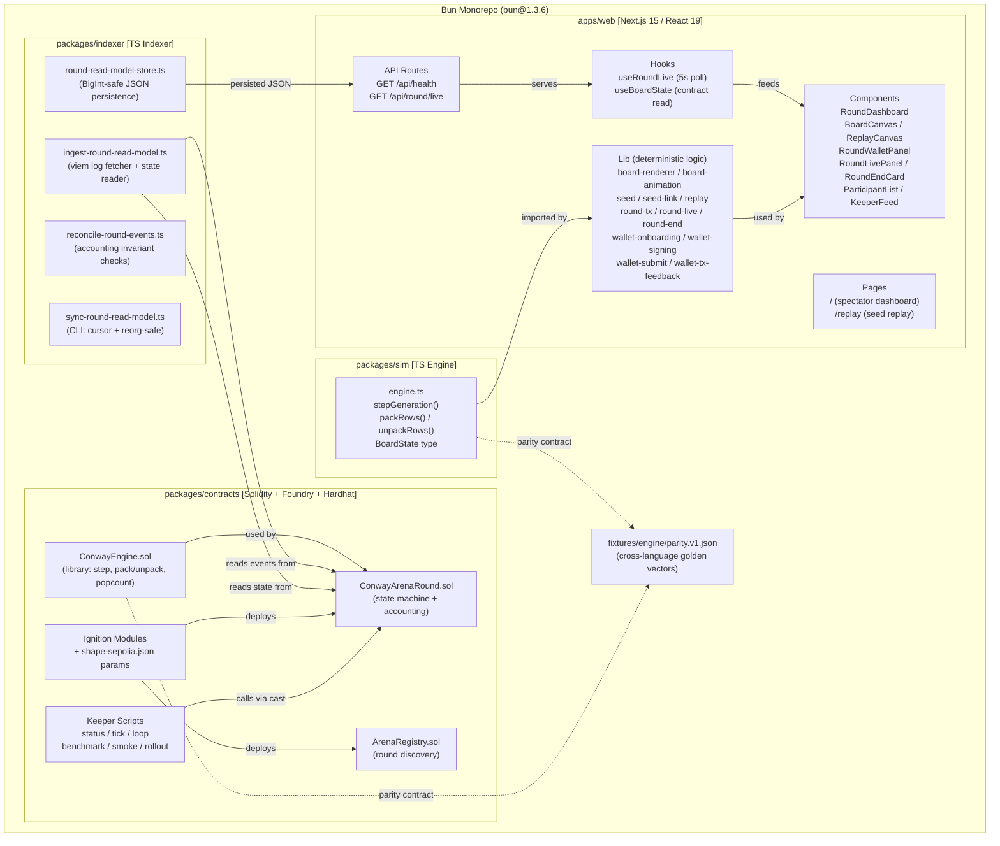

### 8.2 Round Lifecycle State Machine

The 4-phase state machine governing every round, with transition guards and actor permissions.

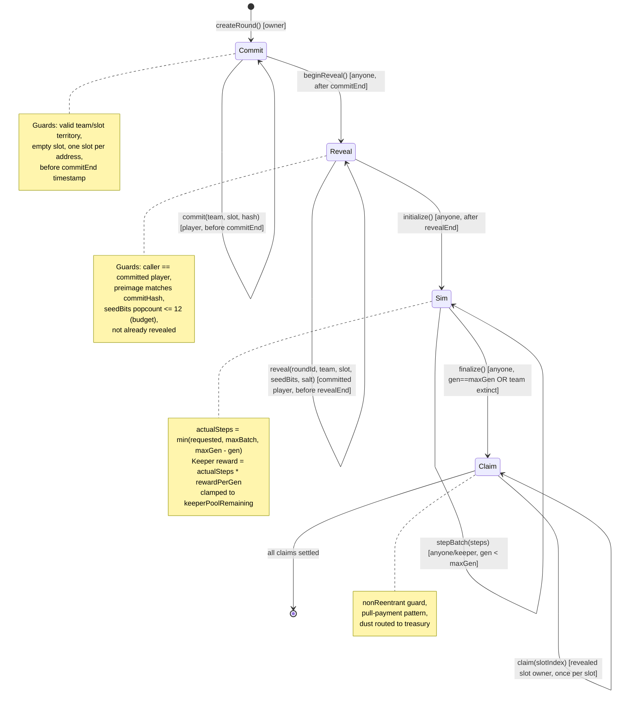

### 8.3 Player Journey

End-to-end user experience from spectating to claiming rewards.

```mermaid
flowchart TD
    START([Spectator visits /]) --> WATCH[Watch live board canvas<br/>See participant list + keeper feed]
    WATCH --> DECIDE{Join round?}
    DECIDE -->|No| WATCH

    DECIDE -->|Yes| CONNECT[Connect wallet via wagmi<br/>Injected connector]
    CONNECT --> CHAIN_CHECK{On Shape Sepolia?}
    CHAIN_CHECK -->|No| SWITCH[Switch network prompt]
    SWITCH --> CHAIN_CHECK
    CHAIN_CHECK -->|Yes| READY[Wallet ready]

    READY --> PICK_TEAM[Choose Blue or Red team]
    PICK_TEAM --> PICK_SLOT[Pick slot from<br/>team territory grid<br/>Blue: tileX 0-3<br/>Red: tileX 4-7]
    PICK_SLOT --> EDIT_SEED[8x8 seed editor<br/>Presets: Glider, R-pentomino, Acorn...<br/>Transforms: rotate/mirror/translate<br/>Budget meter: max 12 live cells]
    EDIT_SEED --> GEN_SALT[Generate random salt<br/>client-side]

    GEN_SALT --> COMMIT_TX[Submit commit tx<br/>commitHash = keccak256(<br/>  roundId, chainId, arena,<br/>  player, team, slot, seedBits, salt)]
    COMMIT_TX --> TX_FLOW_1[simulate -> sign -> confirm]
    TX_FLOW_1 --> WAIT_REVEAL[Wait for reveal phase]

    WAIT_REVEAL --> REVEAL_TX[Submit reveal tx<br/>reveal(roundId, team, slot, seedBits, salt)]
    REVEAL_TX --> TX_FLOW_2[simulate -> sign -> confirm]
    TX_FLOW_2 --> SPECTATE[Watch simulation unfold<br/>Board canvas: live mode<br/>Local TS forward-sim<br/>between onchain checkpoints]

    SPECTATE --> END_SCREEN[End screen appears<br/>Winner, scores, payout summary]
    END_SCREEN --> ELIGIBLE{Eligible to claim?}
    ELIGIBLE -->|Winner or Draw| CLAIM_TX[Submit claim tx]
    ELIGIBLE -->|Lost| REPLAY[View replay with<br/>signature moments]
    CLAIM_TX --> TX_FLOW_3[simulate -> sign -> confirm]
    TX_FLOW_3 --> REPLAY

    REPLAY --> SHARE[Share seed link<br/>?preset=acorn&t=r90,mx&slot=5&team=blue]
```

### 8.4 Data Flow: Onchain to UI

How data flows from Shape L2 contract state through the indexer to the browser.

```mermaid
flowchart LR
    subgraph "Shape L2 (Sepolia / Mainnet)"
        CONTRACT["ConwayArenaRound<br/>contract state"]
        EVENTS["Contract Events<br/>Committed, Revealed,<br/>Initialized, Stepped,<br/>Finalized, PlayerClaimed"]
    end

    subgraph "Indexer (packages/indexer)"
        VIEM_CLIENT["viem publicClient<br/>(Alchemy RPC)"]
        INGEST["buildRoundReadModel()<br/>parallel: readState + getLogs"]
        RECONCILE["reconcileRoundEvents()<br/>keeper-reward consistency<br/>accounting invariant check"]
        STORE["JSON snapshot file<br/>round-read-model.latest.json<br/>(BigInt-safe serialization)"]
        CURSOR["Cursor file<br/>round-read-model.cursor.json<br/>(resumable sync window)"]
    end

    subgraph "Web Server (Next.js)"
        API_LIVE["GET /api/round/live<br/>reads persisted snapshot<br/>normalizes bigint payloads<br/>builds participant roster<br/>builds keeper leaderboard"]
    end

    subgraph "Browser (React 19)"
        POLL_HOOK["useRoundLive()<br/>polls /api/round/live<br/>every 5 seconds"]
        BOARD_HOOK["useBoardState()<br/>direct contract read<br/>getBoardState() view<br/>cached by generation"]
        DASHBOARD["RoundDashboard<br/>(owns poll state,<br/>distributes to children)"]
        CANVAS["BoardCanvas<br/>onchain checkpoint +<br/>local TS forward-sim<br/>between checkpoints"]
    end

    CONTRACT -->|"state reads"| VIEM_CLIENT
    EVENTS -->|"log queries"| VIEM_CLIENT
    VIEM_CLIENT --> INGEST
    INGEST --> RECONCILE
    RECONCILE --> STORE
    INGEST --> CURSOR

    STORE -->|"file read"| API_LIVE
    API_LIVE -->|"JSON response"| POLL_HOOK
    POLL_HOOK --> DASHBOARD
    CONTRACT -->|"direct RPC read<br/>(wagmi publicClient)"| BOARD_HOOK
    BOARD_HOOK --> CANVAS
    DASHBOARD --> CANVAS
```

### 8.5 Board Representation and Rendering Pipeline

How board state is represented, packed for storage, and rendered to pixels.

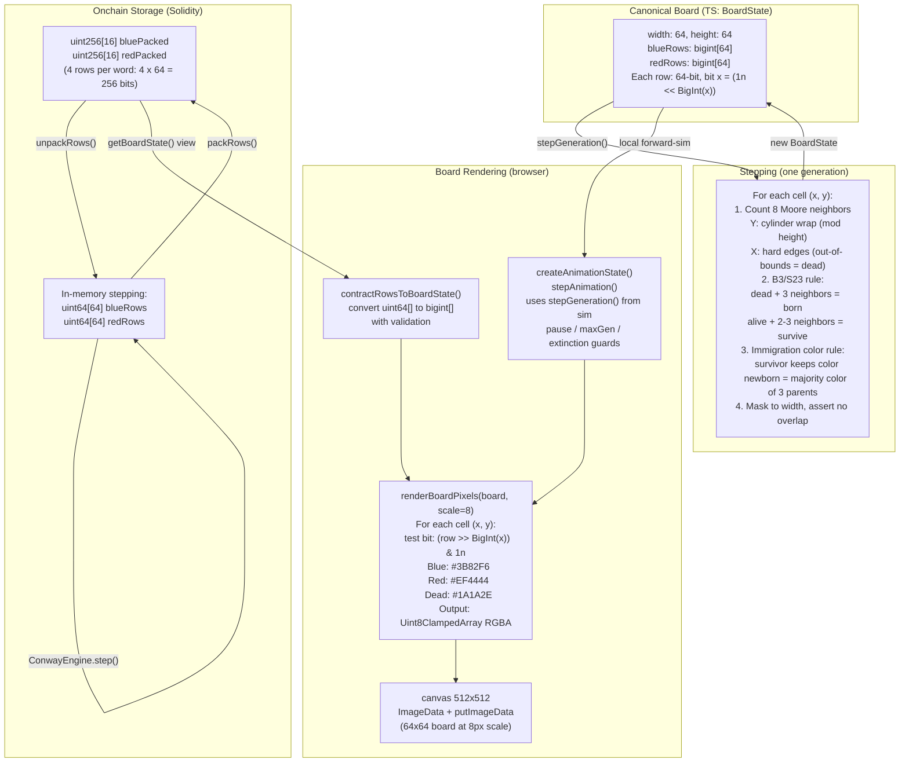

### 8.6 Wallet Transaction Pipeline

The full tx signing flow from draft to confirmation.

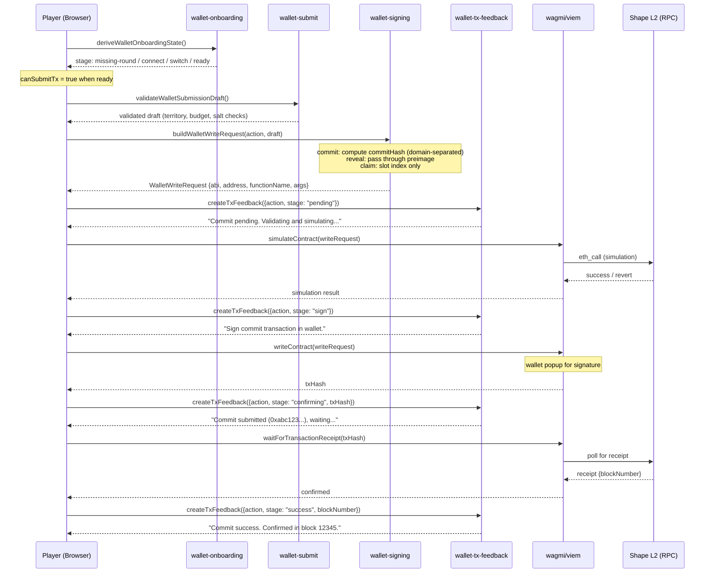

### 8.7 Keeper Automation Loop

How keepers advance the simulation from commit through finalize.

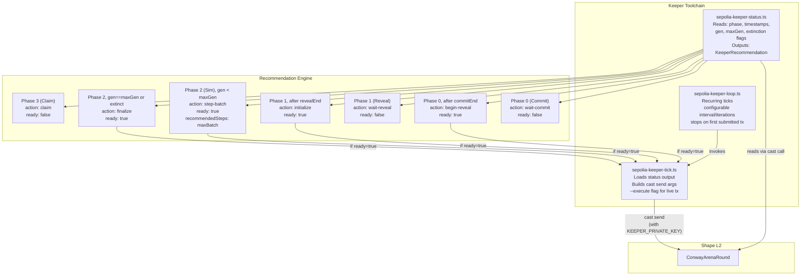

### 8.8 Scoring and Payout Flow

Accounting flow from round funding through to winner claims and keeper withdrawals.

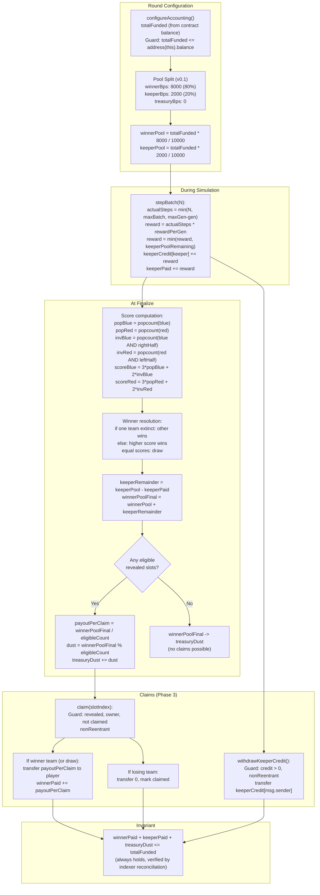

### 8.9 Parity Testing Architecture

How TS and Solidity engines are verified against each other.

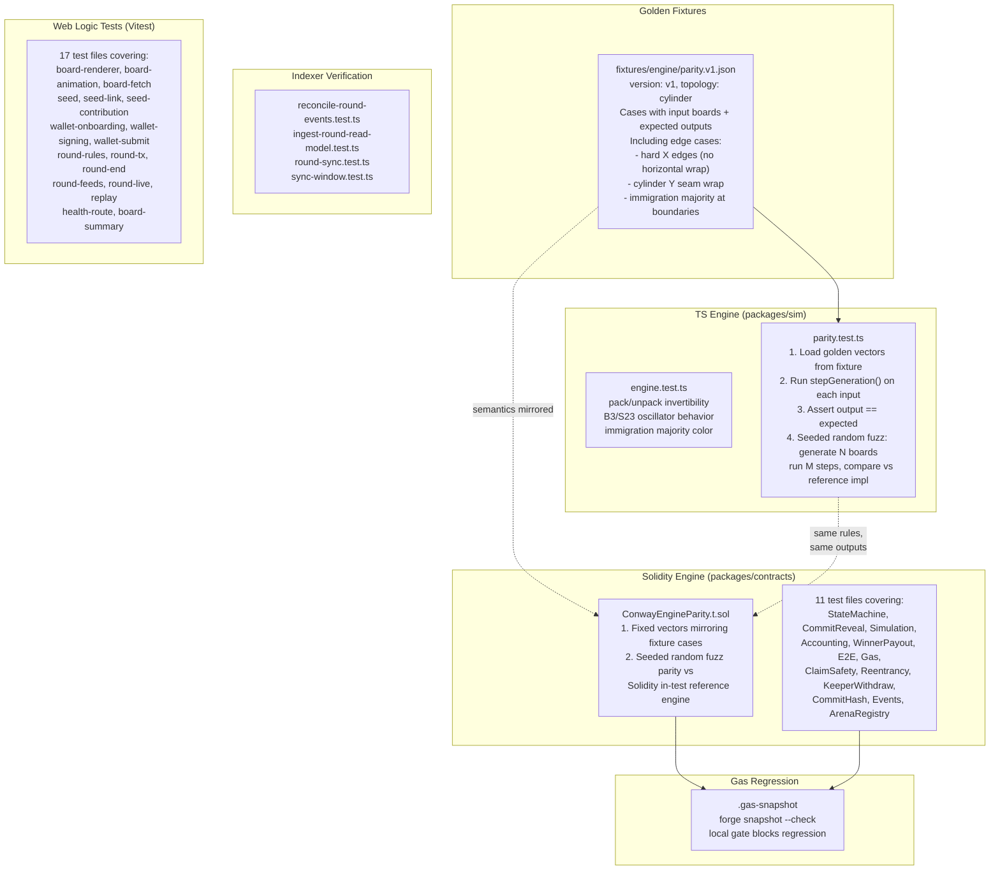

### 8.10 Deployment and Operations Topology

How the system is deployed and operated on Shape Sepolia.

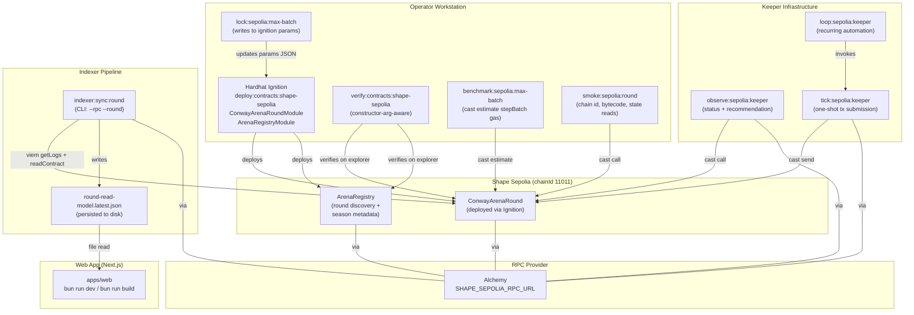

### 8.11 Component Hierarchy (Web UI)

React component tree showing data flow from hooks to leaf components.

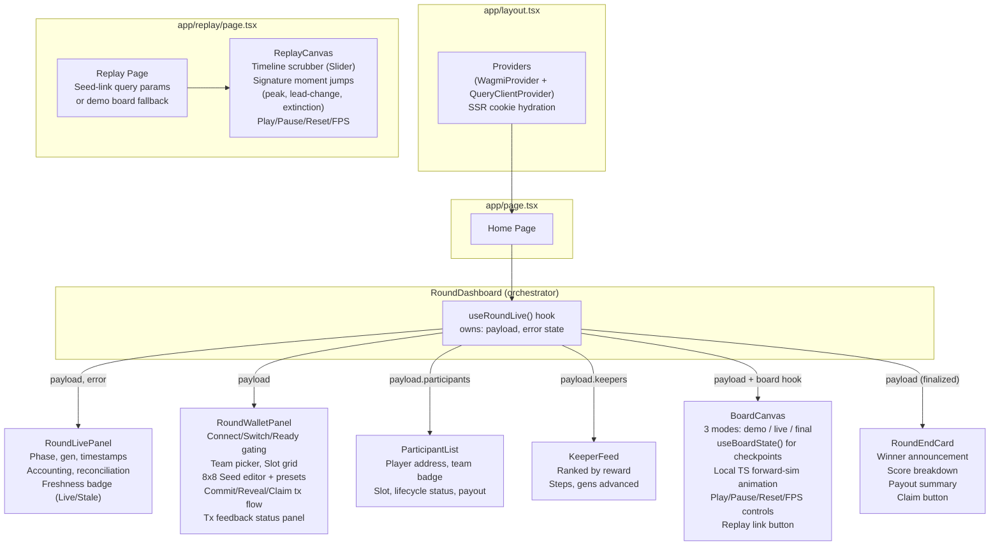

### 8.12 Commit/Reveal Cryptographic Flow

Domain-separated commit hash construction and reveal verification.

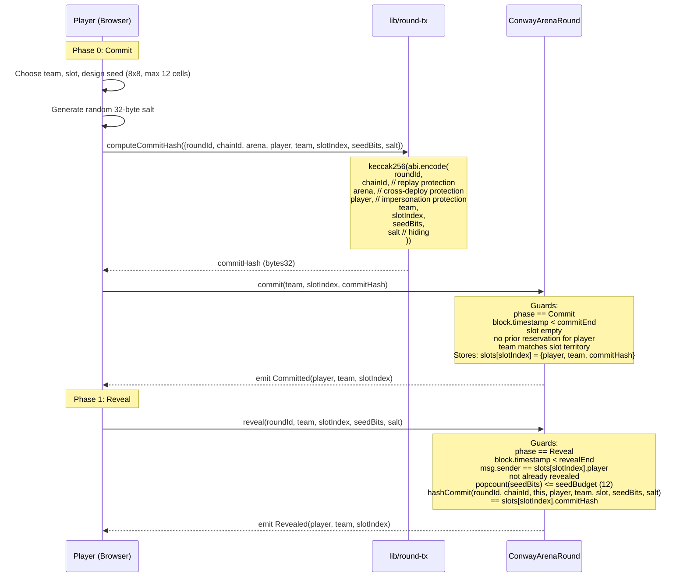

### 8.13 Board Topology and Slot Territory Layout

Visual representation of the 64x64 board, cylinder topology, slot grid, and team territories.

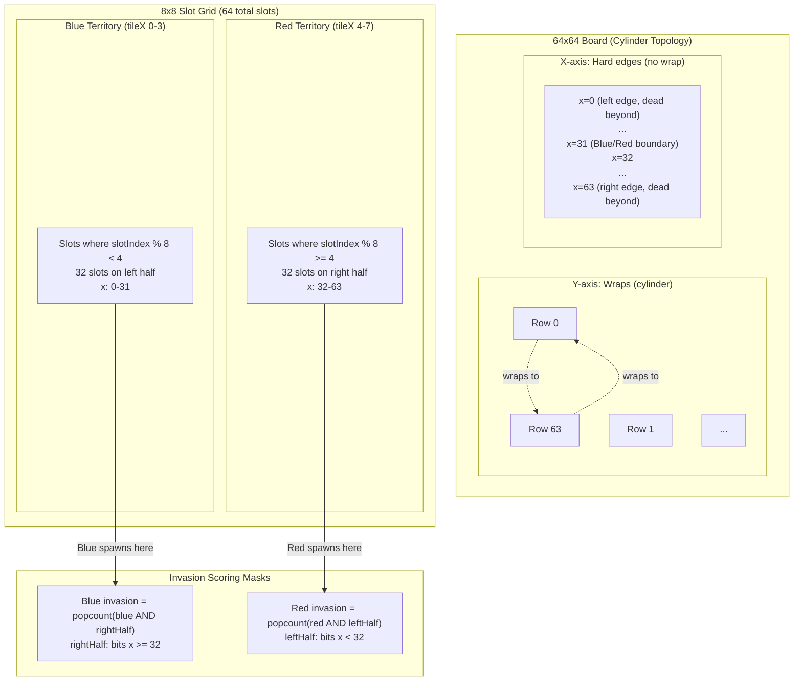

### 8.14 Indexer Reconciliation and Sync Pipeline

Detailed view of how the indexer maintains accounting integrity with reorg safety.

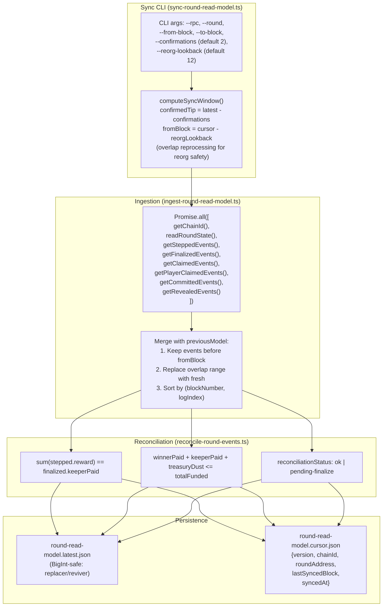
